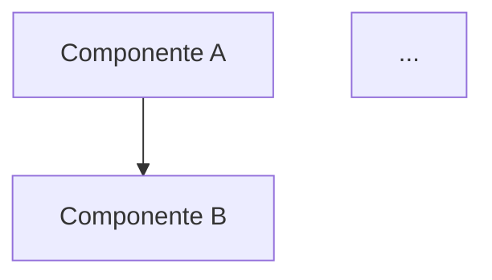

# DEV-002: Arquitectura de Software

**Objetivo:** Diseñar la arquitectura técnica completa de una solución de software, definiendo stack, estructura, componentes y decisiones arquitectónicas fundamentadas.

**Descripción:** Este prompt genera una propuesta arquitectónica completa incluyendo selección de tecnologías, estructura de carpetas, diagrama de componentes, diseño de APIs, modelo de datos y documentación de decisiones con sus trade-offs. El output sirve como blueprint técnico para el equipo de desarrollo.

## Contexto para el Usuario
Utiliza este prompt al inicio de un proyecto nuevo, módulo significativo, o refactorización arquitectónica. Es especialmente valioso cuando se debe alinear al equipo sobre decisiones técnicas importantes o documentar la arquitectura para stakeholders técnicos.

## Cuando usar este prompt
- Inicio de un proyecto nuevo que requiere definición arquitectónica
- Evaluación de migración a nuevas tecnologías
- Documentación de la arquitectura actual para onboarding
- Decisiones entre múltiples alternativas tecnológicas
- Diseño de una funcionalidad que impacta múltiples capas del sistema

## Input necesario
**Descripción del proyecto/funcionalidad:** Alcance, requisitos funcionales clave, restricciones (técnicas, de negocio, legales), usuarios esperados/volumetría, integraciones necesarias, y stack actual (si existe).

## Output esperado
Documento arquitectónico con: stack tecnológico justificado, estructura de carpetas, diagrama de componentes (formato Mermaid), diseño de APIs REST/GraphQL, modelo de base de datos, y ADRs (Architecture Decision Records) con trade-offs.

## Prompt

```
Actúa como un Arquitecto de Software Senior con experiencia en diseño de sistemas escalables. Tu misión es diseñar la arquitectura completa para el siguiente proyecto.

## DESCRIPCIÓN DEL PROYECTO (Input)
[COPIAR AQUÍ LA DESCRIPCIÓN DEL PROYECTO/FUNCIONALIDAD]

---

## INFORMACIÓN ADICIONAL A CONSIDERAR
- **Stack actual de la organización (si aplica):** [Especificar tecnologías ya en uso]
- **Restricciones técnicas:** [Limitaciones conocidas]
- **Restricciones de negocio:** [Presupuesto, tiempo, compliance]
- **Volumetría esperada:** [Usuarios concurrentes, requests/seg, datos a almacenar]
- **Equipo técnico disponible:** [Tamaño y seniority]
- **Integraciones requeridas:** [Sistemas externos con los que debe comunicarse]

---

## ENTREGABLES ARQUITECTÓNICOS

### 1. STACK TECNOLÓGICO
Para cada capa, justificar la elección:

| Capa | Tecnología Seleccionada | Alternativas Consideradas | Justificación |
|------|------------------------|---------------------------|---------------|
| **Frontend** | | | |
| **Backend** | | | |
| **Base de Datos** | | | |
| **Cache** | | | |
| **Colas/Mensajería** | | | |
| **Storage/Archivos** | | | |
| **Infraestructura** | | | |
| **Monitoreo/Observabilidad** | | | |
| **CI/CD** | | | |

**Criterios de selección considerados:**
- Curva de aprendizaje del equipo
- Comunidad y ecosistema
- Costo de licenciamiento/hosting
- Escalabilidad y performance
- Seguridad y compliance

### 2. ESTRUCTURA DE CARPETAS
Proponer la estructura de directorios del proyecto:

```
proyecto/
├── [carpeta]/           # Propósito
│   ├── [subcarpeta]/    # Propósito
│   └── ...
└── ...
```

Justificar:
- Por qué esta estructura sobre otras (Clean Architecture, MVC, etc.)
- Convenciones de nomenclatura
- Qué va en cada carpeta con ejemplos

### 3. DIAGRAMA DE COMPONENTES
Generar diagrama en formato Mermaid que muestre:
- Componentes principales del sistema
- Interfaces entre componentes
- Flujo de datos principal
- Servicios externos integrados



Incluir descripción de cada componente:
| Componente | Responsabilidad | Tecnología | Patrón aplicado |
|------------|-----------------|------------|-----------------|
| [Nombre] | [Qué hace] | [Tech] | [Patrón] |

### 4. DIAGRAMA DE FLUJO DE DATOS
Mermaid diagram mostrando:
- Entradas del sistema
- Procesamiento interno
- Salidas/Almacenamiento
- Flujos críticos vs. secundarios

### 5. DISEÑO DE APIs
Para cada endpoint necesario:

**Recurso: [Nombre del recurso]**

| Método | Endpoint | Descripción | Auth Required |
|--------|----------|-------------|---------------|
| GET | /api/v1/... | [Descripción] | Sí/No |

**Especificación OpenAPI (simplificada):**
```yaml
paths:
  /api/v1/recurso:
    get:
      summary: [Descripción]
      parameters:
        - name: [param]
          in: query/path
          required: true/false
      responses:
        200:
          description: Éxito
          schema:
            type: object
            properties:
              [campo]: [tipo]
        400:
          description: Bad Request
        401:
          description: Unauthorized
        500:
          description: Error interno
```

**Estrategia de versionado:** [URL path / Header / etc.]
**Estrategia de autenticación:** [JWT / OAuth / API Keys / etc.]
**Rate limiting:** [Configuración propuesta]

### 6. MODELO DE BASE DE DATOS
Diagrama ER en Mermaid + descripción:

```mermaid
erDiagram
    ENTIDAD_A ||--o{ ENTIDAD_B : relacion
    ...
```

| Entidad | Descripción | Índices propuestos |
|---------|-------------|-------------------|
| [Nombre] | [Propósito] | [Campos indexados] |

**Estrategia de:**
- Migraciones
- Backups
- Sharding/Particionamiento (si aplica)
- Estrategia de soft-delete

### 7. ARQUITECTURE DECISION RECORDS (ADRs)
Para cada decisión arquitectónica importante:

#### ADR-001: [Título de la decisión]
- **Contexto:** ¿Qué problema estábamos resolviendo?
- **Decisión:** ¿Qué decidimos?
- **Consecuencias:**
  - Positivas: [Beneficios]
  - Negativas: [Trade-offs aceptados]
- **Alternativas consideradas:**
  - [Alternativa 1]: [Por qué se descartó]
  - [Alternativa 2]: [Por qué se descartó]

### 8. ESTRATEGIA DE SEGURIDAD
- Autenticación y autorización
- Manejo de secrets/variables de entorno
- Sanitización de inputs
- CORS y CSRF
- Encriptación en tránsito y en reposo
- Consideraciones específicas de compliance (GDPR, PCI-DSS, etc.)

### 9. ESTRATEGIA DE DEPLOYMENT
- Estrategia: Blue-Green / Canary / Rolling
- Ambientes: Dev → Staging → Prod
- Pipeline CI/CD
- Estrategia de rollback
- Feature flags para releases graduales

### 10. PLAN DE IMPLEMENTACIÓN POR FASES
| Fase | Alcance | Duración Estimada | Dependencias |
|------|---------|-------------------|--------------|
| 1 - MVP Core | [Funcionalidades] | [X semanas] | [Qué necesita] |
| 2 - [Nombre] | [Funcionalidades] | [X semanas] | [Qué necesita] |
| ... | ... | ... | ... |

---

Genera la arquitectura completa siguiendo esta estructura. Prioriza decisiones pragmáticas sobre purismo arquitectónico. Documenta trade-offs explícitamente.
```

## Ejemplo de Uso

**Input ejemplo:**
"Plataforma de reserva de citas médicas para clínica con 50 médicos. Debe permitir a pacientes ver disponibilidad en tiempo real, agendar citas, recibir recordatorios. Los médicos necesitan gestionar su agenda. Integración con sistema de historias clínicas existente vía API REST. Requisitos de HIPAA compliance. 10,000 pacientes activos estimados."

**Output esperado:**
- Stack: React + TypeScript (frontend), Node.js/NestJS (backend), PostgreSQL (BD), Redis (cache), AWS (infra)
- Estructura de carpetas siguiendo Clean Architecture con separación de domain/application/infrastructure
- Diagrama de componentes: API Gateway → Auth Service → Appointment Service → Notification Service → External HIS API
- Endpoints REST documentados: GET /doctors/{id}/availability, POST /appointments, etc.
- Modelo ER: Patient, Doctor, Appointment, Schedule, Notification
- ADRs: Uso de CQRS para consultas de disponibilidad, elección de PostgreSQL sobre Mongo por ACID
- Seguridad: OAuth2 + JWT, encriptación PHI, audit logs
- Deployment: Docker + Kubernetes en AWS

## Notas de calidad
- [ ] Cada tecnología del stack tiene justificación frente a alternativas
- [ ] Los diagramas Mermaid son sintácticamente correctos y comprensibles
- [ ] Cada ADR documenta tanto beneficios como trade-offs aceptados
- [ ] La estructura de carpetas sigue un patrón reconocible (Clean Arch, Hexagonal, etc.)
- [ ] Las APIs incluyen manejo de errores y códigos de estado HTTP
- [ ] El modelo de BD considera índices para queries frecuentes
- [ ] La estrategia de deployment incluye plan de rollback
- [ ] Las decisiones consideran restricciones de equipo y negocio
- [ ] La arquitectura es escalable para la volumetría indicada
